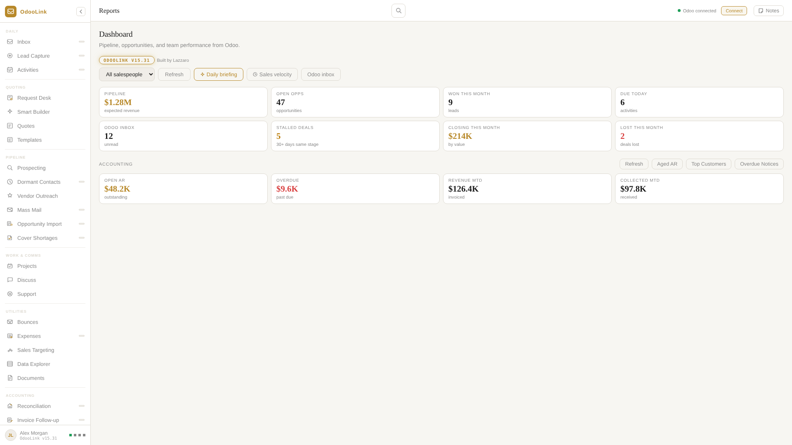
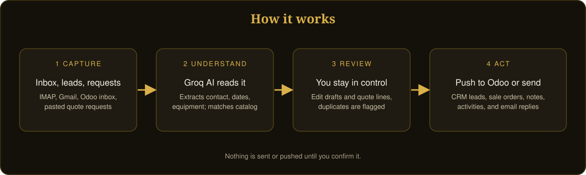
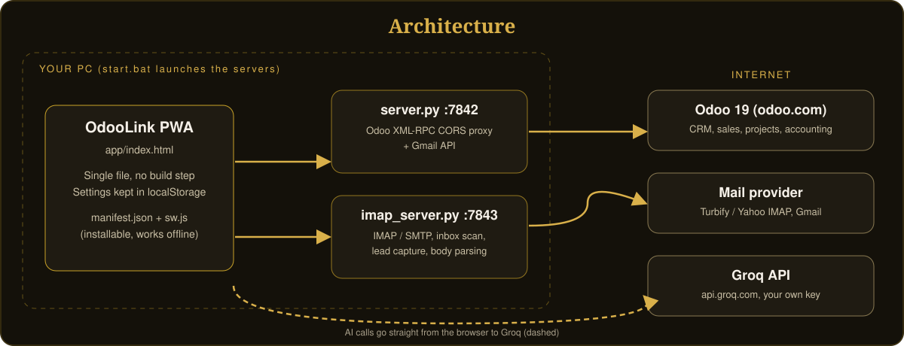

<p align="center"></p>

# OdooLink

**AI-powered sales operations command center for Odoo 19.** One screen for your IMAP and Gmail inboxes, your Odoo CRM, AI-drafted replies, rental quotes, vendor outreach and more. Built by [LAZLAB Creations](https://johnlaz.github.io/).



*Screenshots use simulated data.*

---

## Live URLs

| | |
|---|---|
| Landing page | https://johnlaz.github.io/odoolink/ |
| App | https://johnlaz.github.io/odoolink/app/ |

The app is an installable PWA. It is most useful when run next to its two small local servers (see [Quick start](#quick-start)).

---

## What it does

- **Inbox:** Turbify/IMAP, Odoo and Gmail in one view. AI reply drafts, log to Odoo, bounce detection.
- **Lead Capture:** scan the inbox for leads, AI extracts the contact, push to Odoo CRM. Duplicate check and forwarded-email detection.
- **Activities:** due-today list, AI follow-up drafts, send via IMAP with auto-log.
- **Quotes and Smart Builder:** paste any request, AI extracts contact and equipment, fuzzy-matches your Odoo catalog, pushes a rental order.
- **Request Desk:** AI drafts a response with clarifying questions for vague requests.
- **Projects:** Odoo project and task browser, quick add, task edit with AI rewrite, To Do list, AI brainstorm chat.
- **Pipeline tools:** dormant contacts, vendor outreach, mass mail, opportunity import, bounce manager.
- **Accounting:** reconciliation, invoice follow-up, expenses and vendor bills.
- **Dashboard:** CRM pipeline cards, accounting summary, AI daily briefing.
- **Documents:** local library for W9s, COIs and contracts, attachable to Odoo contacts.

<p align="center"></p>

---

## Quick start

**Requirements:** Windows, Python 3, an Odoo 19 API key, and a free [Groq API key](https://console.groq.com/keys).

1. Keep `index.html`, `server.py`, `imap_server.py` and `start.bat` together in one folder (use the gear menu > **Download Server Files** > **Full app folder (.zip)** to get them).
2. Double-click `start.bat`. It starts both servers and opens the app in Chrome.
3. Open **Settings** and enter your Odoo URL, database, username, API key and Groq key.

| File | Port | Purpose |
|------|------|---------|
| `app/server.py` | 7842 | Odoo XML-RPC CORS proxy and Gmail API |
| `app/imap_server.py` | 7843 | IMAP/SMTP, inbox scan, lead capture, body parsing |

<p align="center"></p>

---

## Repo layout

```
/index.html          landing page
/README.md
/docs/               README visuals (SVG)
/app/index.html      the app (single file)
/app/manifest.json, sw.js
/app/icon-192.png, icon-512.png
/app/shot-*.png      install screenshots (simulated data)
/app/server.py, imap_server.py, start.bat   local servers and launcher
```

---

## AI and model setup

OdooLink uses **Groq** only. Your key is entered in Settings and kept in your browser.

- The model picker ships with three options and a default of `qwen/qwen3.8-27b`.
- Saving a `gsk_` key fetches your current model list from Groq. **Refresh models** does the same on demand.
- Refreshing only **adds** models. Your existing options and your saved selection are never changed. If your saved model is missing from Groq's list it is kept and flagged.
- Newly listed models are untested here. Some may not accept the `reasoning_effort` setting the app sends, in which case you will see an error and can pick another model.

---

## Data and privacy

- Settings, credentials, templates, notes and the document library live in your browser's `localStorage` on your device.
- **Odoo calls:** in *Local Server* mode they go through `server.py` on your PC. In *Proxy* mode they go through public third-party CORS proxies, which see the request. Prefer Local Server mode.
- **AI calls:** email text you ask the AI to read is sent to Groq with your key.
- Both servers listen on `localhost` only.
- `credentials.json` and `token.json` (Gmail authorization) are in `.gitignore`. Never commit them.

---

## Deploy and update

The site is static and served by GitHub Pages from the repo root.

1. Edit `app/index.html`.
2. Bump the version in **both** places so installs refresh: `<meta name="oel-version">` in `app/index.html` and `VERSION` in `app/sw.js`. The in-app stamp reads the meta tag.
3. Commit and push. HTML is fetched network-first, so a normal reload picks it up. Open installs show a small **Reload** prompt when a new version takes over.

If you change `server.py`, `imap_server.py` or `start.bat`, also refresh the embedded copies that Settings falls back to when the app is opened from `file://`.

---

## Changelog

| Version | Highlights |
|---------|-----------|
| **v15.33** | Rental quote replies (Inbox draft and Request Desk) now read the customer's email, repeat back the details already given, and ask only for what is missing, following the Total Rental Solutions intake list. |
| v15.31 | Renamed to OdooLink. Light and gold is the default theme for new installs. Service worker now network-first for HTML with an update prompt. Square, maskable-safe icons, manifest `id`, screenshots and working shortcuts. Groq model refresh added to the existing picker. Settings downloads are current, plus a full app folder zip. Version stamp in the sidebar. README and docs rewritten. |
| v15.30 and earlier | See git history. Highlights: Reconciliation and Invoice Follow-up, Opportunity Import, Mass Mail, Sales Reporting with commission, Expenses rebuilt for Odoo 19, Document Library, Smart Builder, Projects. |

---

&copy; 2026 LAZLAB Creations. All Rights Reserved. &middot; lazlab.io@gmail.com
